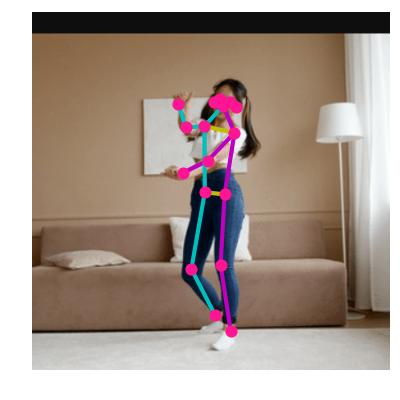

# Pose

看论文的时候发现了 object detection 下面的 pose detection，正好搜到了谷歌的 [MoveNet](https://blog.tensorflow.org/2021/05/next-generation-pose-detection-with-movenet-and-tensorflowjs.html)，推断速度极快，tf 的还提供了预训练的 [lite 模型](https://tensorflow.google.cn/hub/tutorials/movenet?hl=en)，于是我组装了一下。


## 处理流程

1. 通过按下左 Alt 键触发识别
2. 首先根据你的鼠标位置截一个大小为 `window` 的窗口
   
3. 然后 MoveNet 给出姿势判断
   
4. 把鼠标移动到关键点 `nose` 上
   


## requirements

```
keyboard==0.13.5
PyAutoGUI==0.9.53
tensorflow==2.7.0
Pillow==8.3.2
PyDirectInput==1.0.4
```

